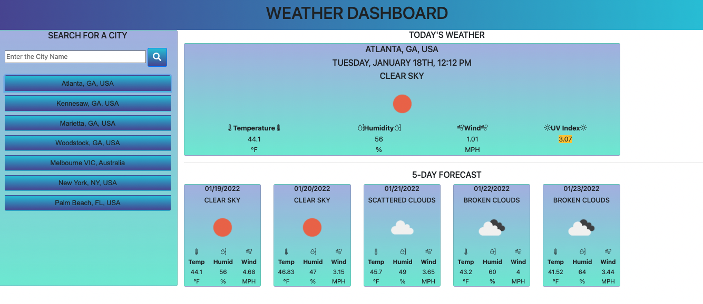

# new_weather_dashboard
## Table of Content
- [Title](#title)
- [User Story](#user-story)
- [Acceptance Criteria](#acceptance-criteria)
- [Deployment](#deployment)
- [Things Not Working](#things-not-working)
- [Project Visual](#project-visual)
- [Tools used](#tools-used)
- [API Used](#api-used)
- [Acknowledgement, & Resources](acknowledgement-and-resources)
## Title
> new_weather_dashboard 🌧️ 
## User Story 📖
```
AS A traveler
I WANT to see the weather outlook for multiple cities
SO THAT I can plan a trip accordingly
```
## Acceptance Criteria ✅
```
GIVEN a weather dashboard with form inputs
WHEN I search for a city
THEN I am presented with current and future conditions for that city and that city is added to the search history
WHEN I view current weather conditions for that city
THEN I am presented with the city name, the date, an icon representation of weather conditions, the temperature, the humidity, the wind speed, and the UV index
WHEN I view the UV index
THEN I am presented with a color that indicates whether the conditions are favorable, moderate, or severe
WHEN I view future weather conditions for that city
THEN I am presented with a 5-day forecast that displays the date, an icon representation of weather conditions, the temperature, the wind speed, and the humidity
WHEN I click on a city in the search history
THEN I am again presented with current and future conditions for that city
```
## Deployment
Two options are provided the first one is link and second one thats click me that will redirect to the page
- Application deployed to [Github](https://github.com/) :
  - https://github.com/dparmar32/new_weather_dashboard
  - [Click Here](https://github.com/dparmar32/new_weather_dashboard)
- Application live GitHub URL submitted link :
  - https://dparmar32.github.io/new_weather_dashboard/
  - [Click Here](https://dparmar32.github.io/new_weather_dashboard/)
## Things not working
 - color code is not working for UV-Index
### From assignment:

### Project Execution:

## Tools Used
- [Postman](https://www.postman.com/)
- [JSON Editor](https://jsoneditoronline.org/)
## API Used
- [AutoComplete Google API](https://developers.google.com/maps/documentation/javascript/examples/places-placeid-finder)
- [Map](https://developer.generalmagic.com/documentation/JavaScript/guide_places_switch_to_GEM.php)
- [Weather API](https://openweathermap.org/api)
## References
- [Moment](https://momentjs.com/?utm_source=cdnjs&utm_medium=cdnjs_link&utm_campaign=cdnjs_library)
- [Icons](https://icons.getbootstrap.com/)
- [Bootstrap](https://getbootstrap.com/docs/5.1/getting-started/introduction/)
- [Button Generator](https://css3buttongenerator.com/)
- [dashboard reference](https://pixinvent.com/modern-admin-clean-bootstrap-4-dashboard-html-template/html/ltr/horizontal-menu-template/card-weather.html)
- [Build examples](https://www.studytonight.com/post/how-to-build-a-weather-app-using-javascript-for-complete-beginners)